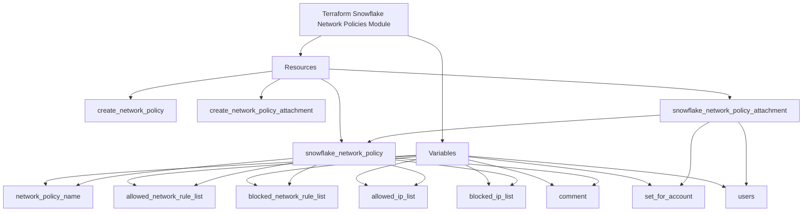

# Terraform Snowflake Network Policies Module

This Terraform module manages Snowflake network policies and their attachments.

<details>
<summary>Module Diagram</summary>



</details>

## Usage

```hcl
module "snowflake_network_policies" {
  source = "git::https://github.com/Richard-Barrett/terraform-snowflake-network-policies.git?ref=0.4.0"

  network_policy_name            = "example_policy"
  allowed_network_rule_list      = ["rule1", "rule2"]
  blocked_network_rule_list      = ["rule3", "rule4"]
  allowed_ip_list                = ["192.168.1.1", "192.168.1.2"]
  blocked_ip_list                = ["10.0.0.1", "10.0.0.2"]
  comment                        = "Example network policy"
  set_for_account                = true
  users                          = ["user1", "user2"]
  create_network_policy          = true
  create_network_policy_attachment = true
}
```

## Variables

| Name                           | Description                                             | Type          | Default | Required |
|--------------------------------|---------------------------------------------------------|---------------|---------|----------|
| `network_policy_name`          | The name of the Snowflake network policy.               | `string`      | n/a     | yes      |
| `allowed_network_rule_list`    | List of allowed network rules.                          | `list(string)`| n/a     | yes      |
| `blocked_network_rule_list`    | List of blocked network rules.                          | `list(string)`| n/a     | yes      |
| `allowed_ip_list`              | List of allowed IP addresses.                           | `list(string)`| n/a     | yes      |
| `blocked_ip_list`              | List of blocked IP addresses.                           | `list(string)`| n/a     | yes      |
| `comment`                      | Comment for the network policy.                         | `string`      | n/a     | yes      |
| `set_for_account`              | Boolean to set the network policy for the account.      | `bool`        | n/a     | yes      |
| `users`                        | List of users to attach the network policy to.          | `list(string)`| n/a     | yes      |
| `create_network_policy`        | Boolean to control the creation of the network policy.  | `bool`        | `true`  | no       |
| `create_network_policy_attachment` | Boolean to control the creation of the network policy attachment. | `bool` | `true` | no       |

The module defines several variables to customize the network policy and its attachment:

- `network_policy_name`: The name of the Snowflake network policy.
- `allowed_network_rule_list`: List of allowed network rules.
- `blocked_network_rule_list`: List of blocked network rules.
- `allowed_ip_list`: List of allowed IP addresses.
- `blocked_ip_list`: List of blocked IP addresses.
- `comment: Commen`t for the network policy.
- `set_for_account`: Boolean to set the network policy for the account.
- `users`: List of users to attach the network policy to.
- `create_network_policy`: Boolean to control the creation of the network policy.
- `create_network_policy_attachment`: Boolean to control the creation of the network policy attachment.

## Defaults

| Name                           | Default |
|--------------------------------|---------|
| `create_network_policy`        | `true`  |
| `create_network_policy_attachment` | `true` |

- `create_network_policy`: Default is `true`.
- `create_network_policy_attachment`: Default is `true`.

<!-- BEGIN_TF_DOCS -->
## Requirements

| Name | Version |
|------|---------|
| <a name="requirement_terraform"></a> [terraform](#requirement\_terraform) | >= 1.5.7 |
| <a name="requirement_snowflake"></a> [snowflake](#requirement\_snowflake) | ~> 0.90.0 |

## Providers

| Name | Version |
|------|---------|
| <a name="provider_snowflake"></a> [snowflake](#provider\_snowflake) | ~> 0.90.0 |

## Modules

No modules.

## Resources

| Name | Type |
|------|------|
| [snowflake_network_policy.this](https://registry.terraform.io/providers/Snowflake-Labs/snowflake/latest/docs/resources/network_policy) | resource |
| [snowflake_network_policy_attachment.this](https://registry.terraform.io/providers/Snowflake-Labs/snowflake/latest/docs/resources/network_policy_attachment) | resource |

## Inputs

| Name | Description | Type | Default | Required |
|------|-------------|------|---------|:--------:|
| <a name="input_allowed_ip_list"></a> [allowed\_ip\_list](#input\_allowed\_ip\_list) | List of allowed IP addresses. | `list(string)` | n/a | yes |
| <a name="input_allowed_network_rule_list"></a> [allowed\_network\_rule\_list](#input\_allowed\_network\_rule\_list) | List of allowed network rules. | `list(string)` | n/a | yes |
| <a name="input_blocked_ip_list"></a> [blocked\_ip\_list](#input\_blocked\_ip\_list) | List of blocked IP addresses. | `list(string)` | n/a | yes |
| <a name="input_blocked_network_rule_list"></a> [blocked\_network\_rule\_list](#input\_blocked\_network\_rule\_list) | List of blocked network rules. | `list(string)` | n/a | yes |
| <a name="input_comment"></a> [comment](#input\_comment) | Comment for the network policy. | `string` | n/a | yes |
| <a name="input_create_network_policy"></a> [create\_network\_policy](#input\_create\_network\_policy) | Boolean to control the creation of the Snowflake network policy. | `bool` | `true` | no |
| <a name="input_create_network_policy_attachment"></a> [create\_network\_policy\_attachment](#input\_create\_network\_policy\_attachment) | Boolean to control the creation of the Snowflake network policy attachment. | `bool` | `true` | no |
| <a name="input_network_policy_name"></a> [network\_policy\_name](#input\_network\_policy\_name) | The name of the Snowflake network policy. | `string` | n/a | yes |
| <a name="input_set_for_account"></a> [set\_for\_account](#input\_set\_for\_account) | Boolean to set the network policy for the account. | `bool` | n/a | yes |
| <a name="input_users"></a> [users](#input\_users) | List of users to attach the network policy to. | `list(string)` | n/a | yes |

## Outputs

| Name | Description |
|------|-------------|
| <a name="output_attached_users"></a> [attached\_users](#output\_attached\_users) | The list of users to whom the network policy is attached. |
| <a name="output_network_policy_name"></a> [network\_policy\_name](#output\_network\_policy\_name) | The name of the created Snowflake network policy. |
<!-- END_TF_DOCS -->

## Licence

MIT License. See [LICENSE](https://github.com/Richard-Barrett/terraform-snowflake-network-policies/blob/main/LICENSE) for full details.
